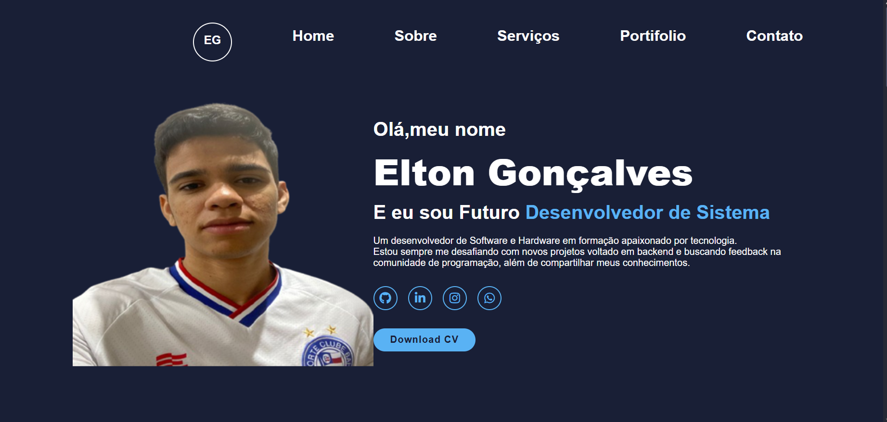

<h1 align="center"> Projeto One Pierce </h1>

Projeto desenvolvido na Semana do 0 ao Programador no  canal DEV EM DOBRO  

  <a href="#-tecnologias">Tecnologias</a>&nbsp;&nbsp;&nbsp;|&nbsp;&nbsp;&nbsp;
  <a href="#-projeto">Projeto</a>&nbsp;&nbsp;&nbsp;|&nbsp;&nbsp;&nbsp;
  <a href="#-layout">Layout</a>&nbsp;&nbsp;&nbsp;|&nbsp;&nbsp;&nbsp;
  <a href="#memo-licença">Licença</a>

  

 

  

## 🚀 Tecnologias

Esse projeto foi desenvolvido com as seguintes tecnologias:

[x]- HTML, CSS e JS
[x]- Git e Github

## 💻 Projeto

Projeto sobre o anime One Pierce .

- [Acesse o projeto finalizado, online](https://github.com/)

## :memo: Licença

Esse projeto está sob a licença MIT.

---

Feito com ♥ by Dev em Dobro :wave: